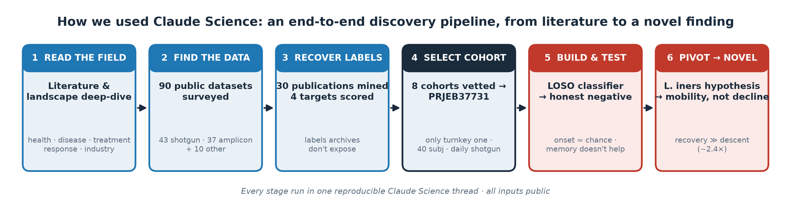
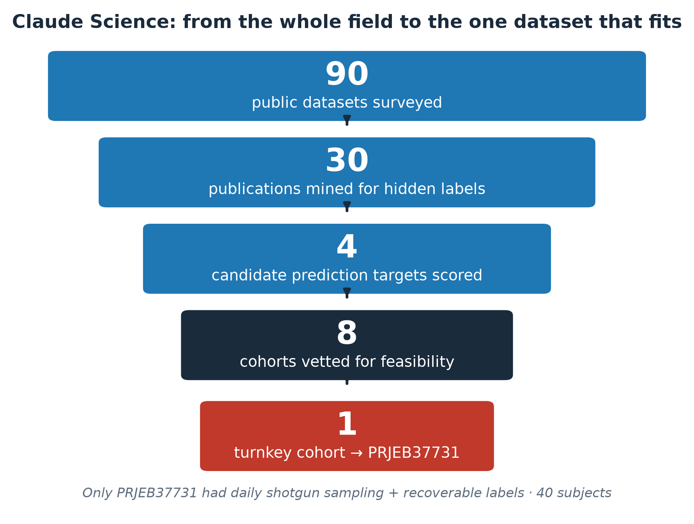
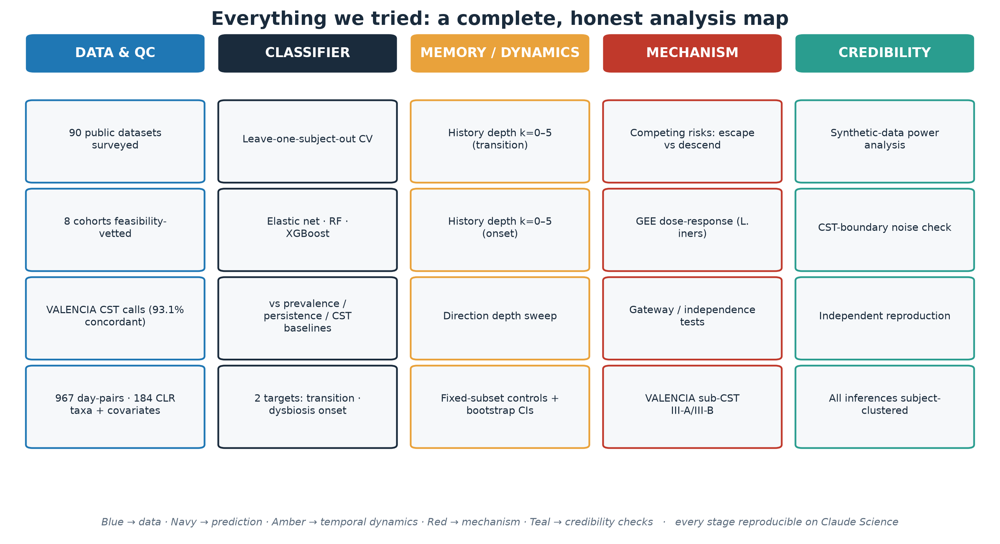

<div align="center">

# 🧬 Vaginal Microbiome Instability — a Claude Science discovery

### Predicting near-term vaginal-microbiome dynamics from a baseline metagenomic profile

**A rigorous classifier · an honest negative · and the novel finding it uncovered**

[](https://claude.ai)
[](https://www.ebi.ac.uk/ena/browser/view/PRJEB37731)
[](#-reproduce)


*Lactobacillus iners* — the textbook "gateway to dysbiosis" — is really a marker of **mobility, not decline.**

</div>

---

## 📖 The report — start here

> ### 👉 **The full scientific write-up is [`docs/README_submission.md`](docs/README_submission.md)**
>
> It contains **everything we tried**, with a clear narrative: the classifier and why it's solid → the honest negative result → the hypothesis pivot → the novel *L. iners* finding → background, limitations, and what a next cohort would unlock. A consolidated Word version is at [`docs/manuscript_iners_instability.docx`](docs/manuscript_iners_instability.docx).
>
> **Presentation & video:** [`docs/presentation_3min.pptx`](docs/presentation_3min.pptx) · [`docs/presentation_text_3min.md`](docs/presentation_text_3min.md) · [`docs/video_script_3min.md`](docs/video_script_3min.md)

---

## 🔬 How we used Claude Science — the whole discovery, end to end



This project's real story is the **workflow**: Claude Science read the literature, surveyed the public data landscape, mined papers to recover hidden outcome labels, selected the one feasible cohort, built and honestly tested a classifier, and then turned the negative result into a novel mechanistic finding — all in one reproducible thread.

<div align="center">



</div>

---

## 🧭 Study outline

| Stage | What happened | Artifact |
|:--:|---|---|
| **1 · Read the field** | Literature + landscape deep-dive (health, disease, treatment response, industry) | [`docs/`](docs/) |
| **2 · Find the data** | **90** public datasets surveyed (43 shotgun, 37 amplicon, 10 other) | [`figures/vaginal_landscape.png`](figures/vaginal_landscape.png) |
| **3 · Recover labels** | **30** publications mined → **4** candidate targets scored on real label availability | [`figures/dataset_selection_funnel.png`](figures/dataset_selection_funnel.png) |
| **4 · Select cohort** | **8** cohorts feasibility-vetted → only **PRJEB37731** turnkey (40 subj, daily shotgun) | [`DATA.md`](DATA.md) |
| **5 · Build & test** | Leave-one-subject-out classifier, honest baselines → **honest negative** | [`figures/hero_transition_vs_onset.png`](figures/hero_transition_vs_onset.png) |
| **6 · Pivot → novel** | *L. iners* hypothesis → **mobility, not decline** | [`figures/hero_iners_mobility.png`](figures/hero_iners_mobility.png) |

### Everything we tried, at a glance



---

## 📊 Key results

| Question | Answer |
|---|---|
| Predict *any* next-day community transition? | **AUROC 0.66** — but a current-state baseline matches it; the full microbiome adds nothing |
| Predict next-day **onset of dysbiosis** from a non-dysbiotic day? | **≈ chance** (AUROC 0.51–0.55); adding up to **5 days of memory does not help** |
| Does *L. iners* drive instability? | **Yes** — adjusted movement **OR 5.87** (95% CI 3.15–10.94, *p* = 2.5×10⁻⁸) |
| Is that instability *decline*? | **No** — from CST III, recovery **0.57** beats descent to dysbiosis **0.24** (**~2.4×**) |
| Is CST III a preferential *gateway* to dysbiosis? | **No** — gateway χ² *p* = 0.56; next-day state near-independent of current (χ² *p* = 0.69) |

<div align="center">

### The headline finding


</div>

---

## 🗂️ Repository layout

```
📁 Anthropic_hackathon_Claude_Science
├── 📄 README.md                     ← you are here
├── 📄 DATA.md                       ← data provenance & label definitions
├── 📁 docs/
│   ├── ⭐ README_submission.md       ← THE FULL REPORT (everything we tried)
│   ├── 📊 presentation_3min.pptx     ← recording-ready slide deck
│   ├── 🗣️ presentation_text_3min.md  ← exact speaking text
│   ├── 🎬 video_script_3min.md       ← 3-min video script
│   └── 📝 manuscript_iners_instability.docx
├── 📁 data/         cst_calls · modeling_dataset (parquet+csv) · valencia_mapping
├── 📁 src/          cv_harness · train_models · history_depth_transition · history_depth_onset
├── 📁 results/      18 scored CSVs — model metrics, GEE, gateway, memory, power
└── 📁 figures/      hero figures, workflow & analysis diagrams, QC panels
```

---

## ⚙️ Reproduce

```bash
pip install -r requirements.txt          # Python 3.13
python src/train_models.py               # → results/model_results.csv
python src/history_depth_transition.py   # → results/S3_history_depth_results.csv
python src/history_depth_onset.py        # → results/S3_onset_history_depth_results.csv
```

All predictive evaluation uses **leave-one-subject-out** cross-validation (no subject in both train and test); all effect estimates use **subject-clustered GEE**. The null result is backed by a **synthetic-data power analysis** — see the report.

---

## ⚠️ Scope & limitations

Single cohort, **n = 40**, **no external validation** — public vaginal metagenomics with linked longitudinal outcomes is genuinely scarce, and we report that as a first-order constraint, not a footnote. CST calls depend on the taxonomic pipeline (VALENCIA-concordant). Results are **discovery-stage and associational — not for clinical use.** Full detail in [`docs/README_submission.md`](docs/README_submission.md#limitations) and [`DATA.md`](DATA.md).

---

## 📚 Data citation

France MT *et al.* **VALENCIA: a nearest-centroid classification method for vaginal microbial communities.** *Microbiome* (2020). Cohort: ENA BioProject **PRJEB37731**.

<div align="center">

*Built end-to-end on **Claude Science** — literature to novel finding, one reproducible thread.*

</div>
