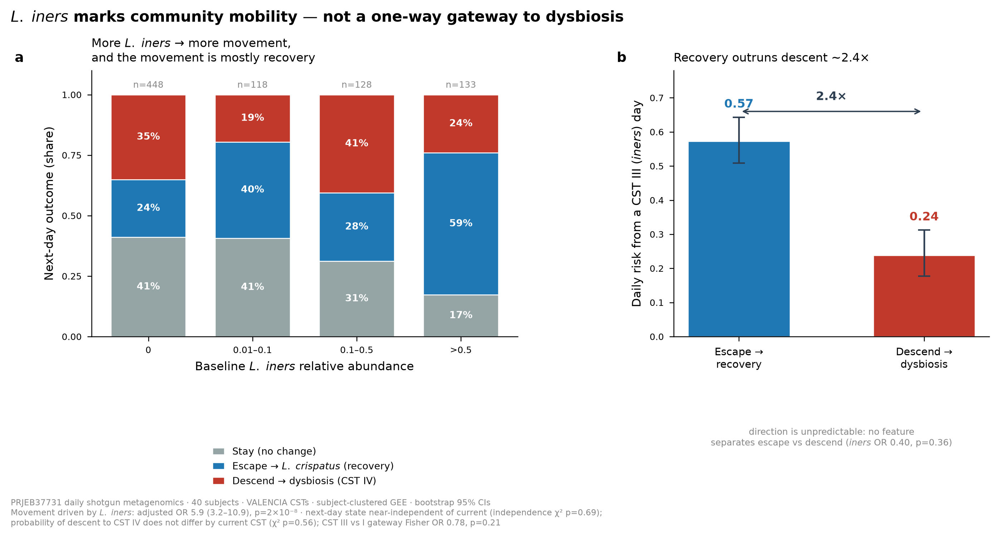

# Vaginal Microbiome Instability Classifier

**Built with Claude: Life Sciences — Lab Track submission**

Predicting near-term vaginal-microbiome dynamics from a baseline metagenomic profile,
using only public data. This repository contains a leakage-safe classifier, an honestly
negative primary result, and the novel mechanistic finding it uncovered about
*Lactobacillus iners*.



## The story in one line

We built a rigorous, leave-one-subject-out classifier to predict vaginal-microbiome
transitions; the primary result was honestly negative (composition adds nothing beyond
current state, and next-day dysbiosis onset is unpredictable); so we tested a mechanistic
hypothesis about *L. iners* — and found it marks community **mobility, not decline**,
refining the textbook "iners-as-gateway-to-BV" narrative.

## Key results

| Question | Result |
|---|---|
| Predict *any* next-day CST transition | AUROC **0.66** (current CST + covariates; ML does not beat it) |
| Predict next-day **onset of dysbiosis** from a non-dysbiotic day | **≈ chance** (AUROC 0.51–0.55); adding up to 5 days of memory does not help |
| Does *L. iners* drive instability? | **Yes** — adjusted movement OR **5.87** (95% CI 3.15–10.94, p=2.5×10⁻⁸) |
| Is that instability decline? | **No** — from a CST III day, recovery (0.57) outruns descent to dysbiosis (0.24) ~2.4× |
| Is CST III a preferential gateway to CST IV? | **No** (gateway χ² p=0.56; independence χ² p=0.69) |

## Repository layout

```
├── README.md                     # this file
├── docs/
│   ├── README_submission.md      # full submission writeup (Part 1 classifier → Part 2 finding)
│   ├── video_script_3min.md      # 3-minute video script + asset checklist
│   └── manuscript_iners_instability.docx  # consolidated project report
├── data/                         # inputs (see DATA.md for provenance)
│   ├── cst_calls.csv             # per-sample VALENCIA CST calls + next-day labels
│   ├── modeling_dataset.parquet  # 967 day-pairs × 209 features (CLR taxa + covariates)
│   └── valencia_taxon_mapping.csv
├── src/
│   ├── cv_harness.py             # leave-one-subject-out CV utilities
│   ├── train_models.py           # baselines + elastic-net / RF / XGBoost, both targets
│   ├── history_depth_transition.py  # memory sweep, transition & direction targets (S3)
│   └── history_depth_onset.py    # memory sweep, dysbiosis-onset target (S3b)
├── results/                      # all scored CSVs (model metrics, GEE, gateway, power)
├── figures/                      # publication-grade figures + model card
├── requirements.txt
└── LICENSE
```

## Reproduce

```bash
pip install -r requirements.txt          # Python 3.13
python src/train_models.py               # -> results/model_results.csv
python src/history_depth_transition.py   # -> results/S3_history_depth_results.csv
python src/history_depth_onset.py        # -> results/S3_onset_history_depth_results.csv
```

All predictive evaluation uses **leave-one-subject-out** cross-validation (no subject in
both train and test); all inferential estimates use subject-clustered GEE.

## Data & limitations

Discovery cohort: **PRJEB37731** (Danish daily vaginal shotgun metagenomics, public via ENA),
40 subjects. Single cohort, **no external validation** — public vaginal metagenomics with
linked outcomes is scarce. See [DATA.md](DATA.md) and the limitations section of the
submission writeup. Results are discovery-stage and associational; not for clinical use.

## Citation of the primary data

France MT et al. *VALENCIA: a nearest-centroid classification method for vaginal microbial
communities.* Microbiome 2020. Cohort: BioProject PRJEB37731.
